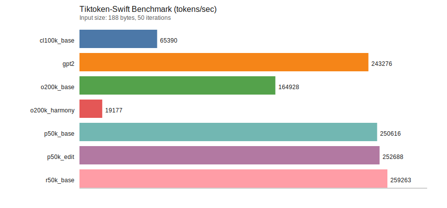

# Tiktoken-Swift

Native Swift 6.2 implementation of [OpenAI’s tiktoken tokenizer](https://github.com/openai/tiktoken). This package mirrors the behavior of the reference tiktoken (Python/Rust) implementation while staying fully Swift/SwiftPM friendly.

Reference target: `openai/tiktoken` `0.12.0`, plus the upstream GitHub `main` large-input BPE fix for long merge pieces.

## Highlights

- Swift 6.2, no Rust/Python dependencies.
- Supports GPT-2, r50k, p50k, cl100k, o200k encodings.
- Special token safeguards (allowed/disallowed).
- Batch encoding with parallelism.
- Batch decoding and byte decoding helpers.
- Token byte inspection and decode offsets.
- Deterministic encoding/decoding with round‑trip tests.
- Benchmark target with throughput metrics.

## Installation (SwiftPM)

Add the package in Xcode or `Package.swift`:

```swift
.package(url: "https://github.com/Xopoko/Tiktoken-Swift.git", from: "0.1.0")
```

Then add `Tiktoken` as a dependency of your target.

## Quick Start

```swift
import Tiktoken

let enc = try Tiktoken.getEncoding("cl100k_base")
let tokens = try enc.encode("hello world")
let text = try enc.decode(tokens)
```

### Special Tokens

```swift
let enc = try Tiktoken.getEncoding("cl100k_base")
let tokens = try enc.encode("hello <|endoftext|>", allowedSpecial: .all)
```

### Batch Encoding

```swift
let enc = try Tiktoken.getEncoding("cl100k_base")
let batch = try enc.encodeBatch(["hello", "world"])
```

### Batch Decoding & Token Inspection

```swift
let enc = try Tiktoken.getEncoding("cl100k_base")
let tokens = try enc.encode("hello world")
let bytesByToken = try enc.decodeTokensBytes(tokens)
let decoded = try enc.decodeBatch([tokens])
let byteValues = enc.tokenByteValues()
let eotIsSpecial = enc.isSpecialToken(enc.eotToken!)
let offsets = try enc.decodeWithOffsets(tokens)
```

### Model Mapping

```swift
let enc = try Tiktoken.encoding(forModel: "gpt-5.2")
```

### Upstream Reference

```swift
Tiktoken.referenceVersion // "0.12.0"
```

## Encodings

- `gpt2`
- `r50k_base`
- `p50k_base`
- `p50k_edit`
- `cl100k_base`
- `o200k_base`
- `o200k_harmony`

## Data Files & Caching

This package validates all tokenizer data with SHA‑256 hashes from OpenAI’s public release. Files are bundled in `Resources/encodings` and can also be cached locally.

Environment variables:

- `TIKTOKEN_CACHE_DIR`
- `DATA_GYM_CACHE_DIR`

Set either to control where cached files are stored. Set to an empty string to disable caching.

## Benchmarks / Metrics

Run the benchmark target:

```bash
swift run TiktokenBenchmark
```

The benchmark reports tokens/sec and bytes/sec for each encoding.

### Benchmark Plot



Note: results depend on hardware, OS, and build configuration. Re-run `swift run TiktokenBenchmark` on your machine to regenerate numbers.

## Tests

```bash
swift test
swift test -c release
```

## License

This repository reuses public OpenAI tokenizer files and mirrors tiktoken behavior. See `tiktoken/LICENSE` for reference and the package license in this repository.
